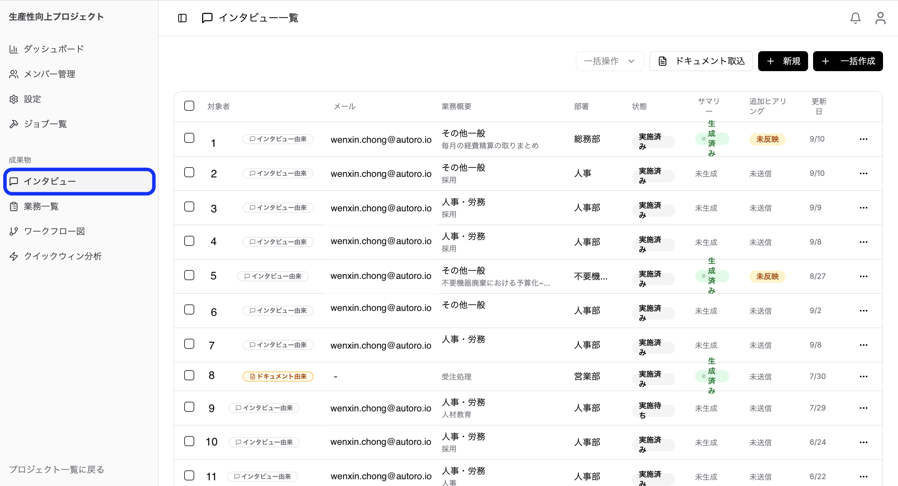
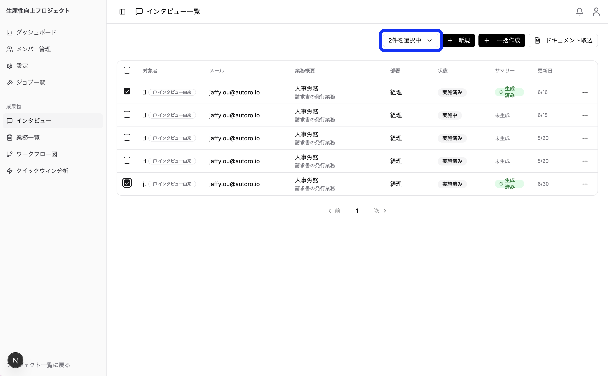
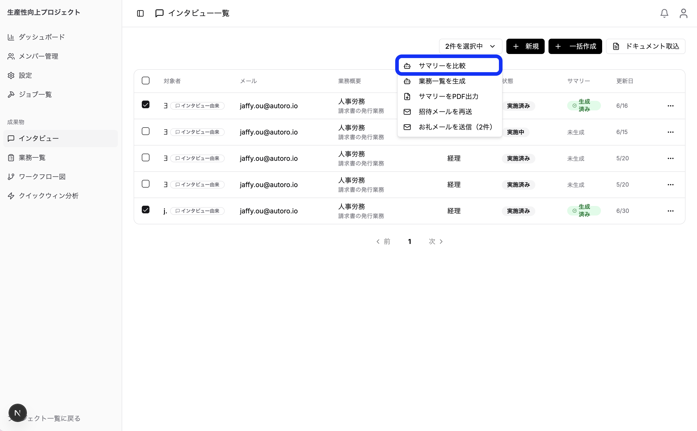

### サマリー比較

### 概要

「サマリー比較」は、複数のインタビューのサマリーをAIが自動で読み比べ、対象者どうしの**共通点と相違点**を表形式で整理してくれる機能です。同じ業務を複数人にインタビューした場合や、似た業務を比較したい場合に、担当者ごとの進め方の違いや共通する手順を一目で把握できます。

インタビュー一覧ページから利用します。

### 使い方

1. **インタビュー一覧ページ**を開きます。

2. 比較したいインタビューのチェックボックスを選択します（**2件以上、最大5件**まで）。
3. 選択すると表示される「〇件を選択中」ボタンを押し、メニューから「**サマリーを比較**」を選びます。

4. 「サマリー比較を開始しました」と表示されれば受付完了です。比較はバックグラウンドで処理されます。
5. 処理が終わると、画面右上の **通知** に「サマリー比較完了」が表示されます。
6. その通知をクリックすると、「サマリー比較結果」が開き、比較内容を確認できます。

### 選択できるインタビューの条件

サマリー比較の対象にできるのは、次の条件をすべて満たすインタビューです。

- ステータスが「**実施済み（completed）**」であること
- **サマリーが生成済み**であること

未実施のインタビューやサマリーが未生成のインタビューは対象になりません。条件を満たすインタビューが2件未満の場合は比較を開始できません。

| 項目 | 条件 |
| :---- | :---- |
| 選択できる件数 | 2件以上・5件以下 |
| インタビューの状態 | 実施済み |
| サマリー | 生成済みであること |

### 比較結果の内容

比較結果は、以下の6つのセクションで構成された表形式のレポートとして出力されます。対象者ごとに列が分かれ、複数人の内容を横並びで見比べられます。

1. **比較対象** … 今回比較した対象者の一覧（対象者・部署・業務名）
2. **総評** … 業務差分の大きさ（大／中／小）、業務の関係性（ほぼ同じ業務／手順違いあり／関連するが別業務／別業務）、および全体の共通点・相違点
3. **業務概要の比較** … 業務の目的・ゴール、トリガー、成果物、関係者・連携部署、発生頻度・処理件数などの観点での比較
4. **プロセスの比較** … 業務の手順（プロセス）を同じフェーズ・タイミングごとに横並びで比較
5. **分岐・例外処理の比較** … 条件や場面ごとの分岐・例外対応の比較
6. **課題・改善要望の比較** … 各対象者が挙げた課題や改善要望の比較

各セクションでは「共通点」と「相違点」が整理され、比較しやすい簡潔な表現でまとめられます。

### 補足・注意事項

- 比較はAIによる処理のため、完了までに少し時間がかかる場合があります。開始後は他の操作を続けても問題ありません。処理が完了すると通知に表示されます。
- 比較結果は、各インタビューの**サマリーに書かれている内容**をもとに作成されます。サマリーに記載のない事柄は「不明」として扱われ、推測での断定は行われません。より充実した比較結果を得るには、比較前に各インタビューのサマリーが十分に作成されていることをご確認ください。
- 一度に比較できるのは最大5件までです。6件以上を比較したい場合は、対象を分けて複数回実行してください。
