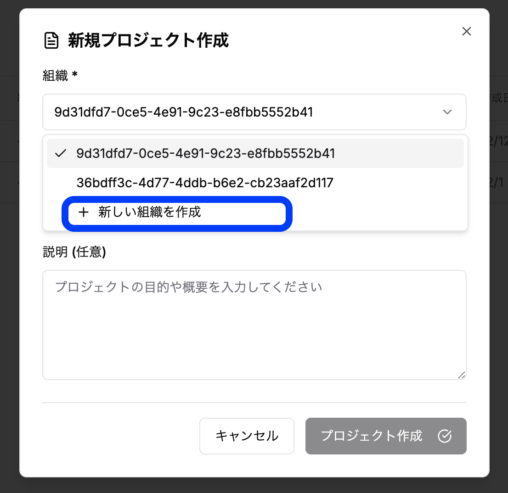
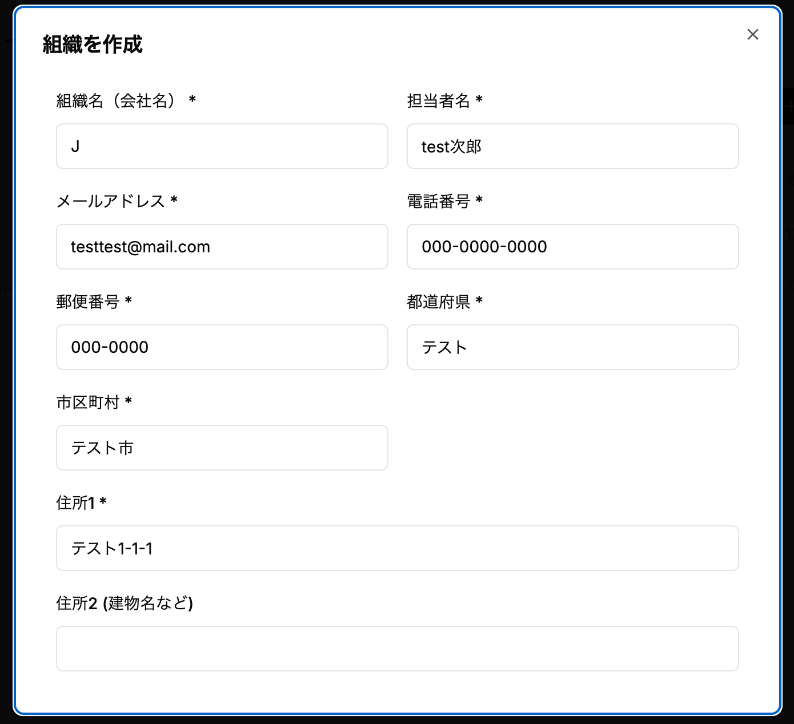

### 3.1 組織の作成・編集

**作成**
1. プロジェクト右上にあるプロジェクトの作成をクリック

2. 組織の部分をクリックし、「新しい組織を追加」を選びます

3. 組織の情報を入力します

**編集**
1. 画面右上のユーザーメニューをクリック

2. 組織をクリック

3. 編集ボタンをクリック

4. 保存をクリックします

### 3.2 組織メンバーの追加・役割設定

プロジェクトメンバーの管理については、「第4章：プロジェクト管理」の[「4.4 プロジェクトメンバーの招待と管理」](/guides/4-project-management/#44-プロジェクトメンバーの招待と管理)を参照してください。
