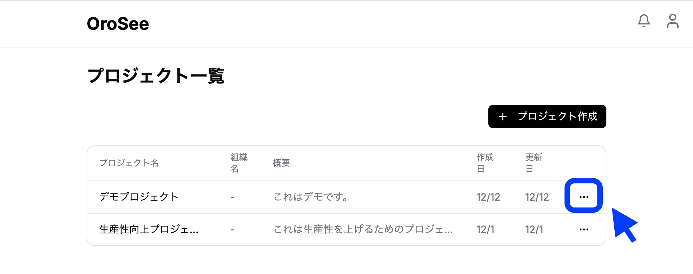
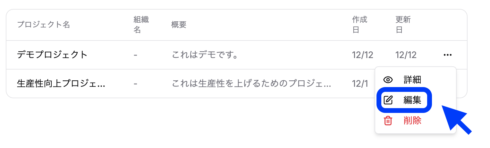
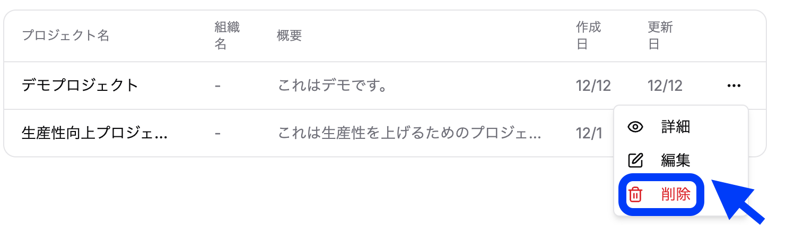
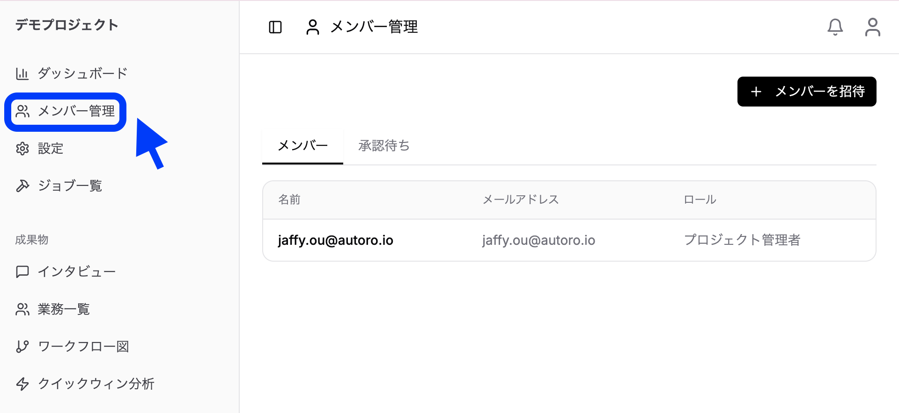
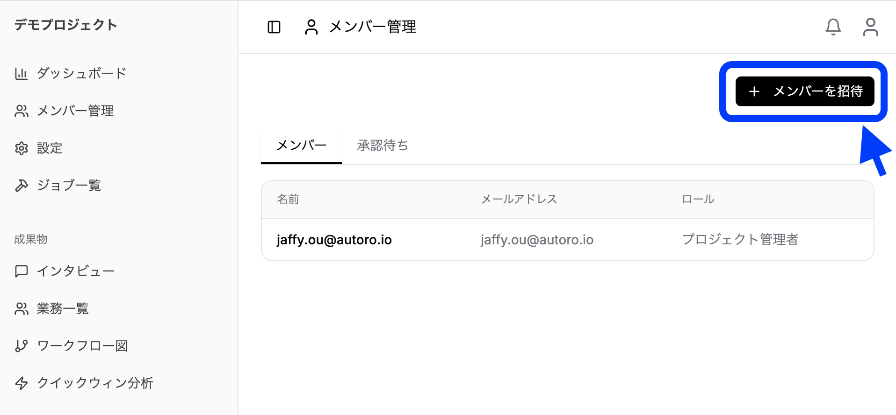
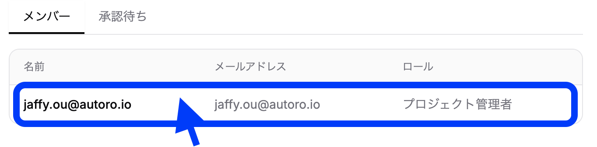
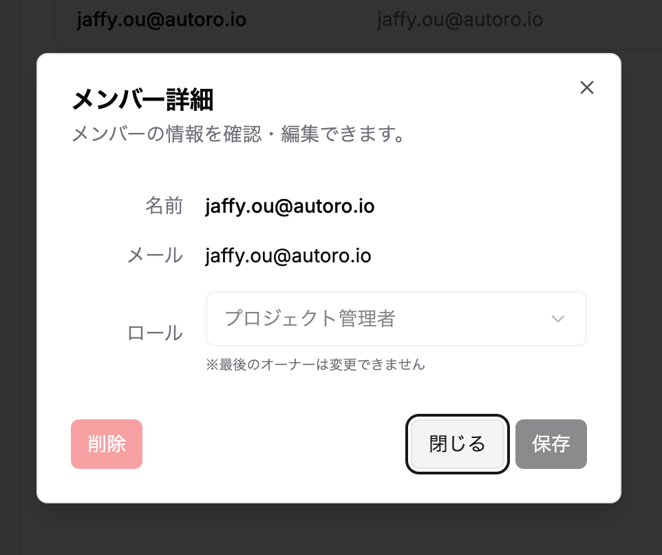
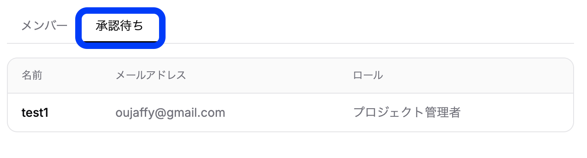
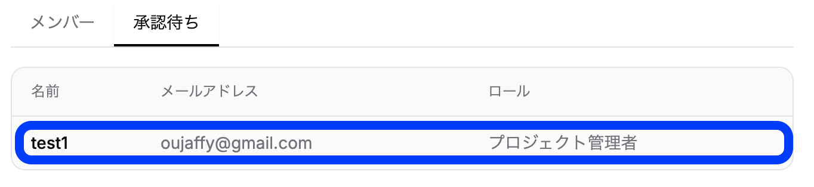
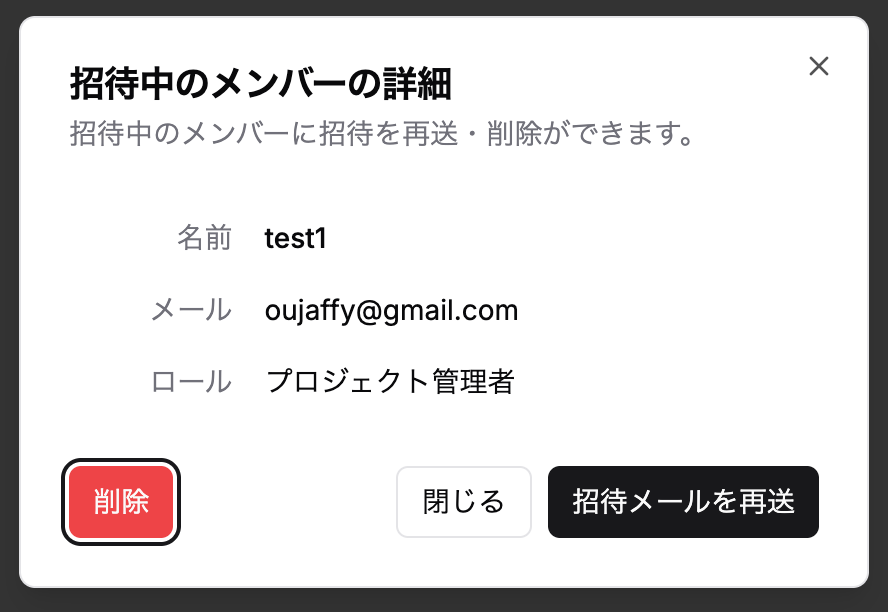

### 4.1 プロジェクト一覧画面の見方

ログイン後、最初に表示されるのがプロジェクト一覧画面（`/projects`）です。

**画面構成：**
- **プロジェクトカード**: 各プロジェクトの概要が表示される
  - プロジェクト名
  - 組織名
  - 概要
  - 作成日時
  - 更新日
- **プロジェクト作成**: 新しいプロジェクトを作成

### 4.2 プロジェクトの作成

1. プロジェクト一覧画面で「新規プロジェクト」ボタンをクリック

2. プロジェクト作成ダイアログが表示される
3. 以下の情報を入力：
   - **組織**（必須）：プロジェクトが所属する組織
   - **プロジェクト名**（必須）：識別しやすい名前を入力
   - **説明**（任意）：プロジェクトの目的や概要を入力（Markdown形式対応）
4. 「作成」ボタンをクリック
5. プロジェクトが作成され、ダッシュボードに遷移

### 4.3 プロジェクトの編集・削除

**編集：**
1. プロジェクト一覧ページにアクセス

2. 編集アイコンをクリック

3. プロジェクト名・説明を修正
4. 「保存」をクリック

**削除：**
1. プロジェクト設定画面にアクセス

2. 「プロジェクトを削除」ボタンをクリック

3. 確認ダイアログで「削除」を選択

> **⚠️ 警告：** プロジェクトを削除すると、関連するすべてのデータ（業務、インタビュー、ワークフローなど）も完全に削除されます。この操作は取り消せません。

### 4.4 プロジェクトメンバーの招待と管理

**メンバーの招待：**

1. サイドバーから「メンバー管理」メニューを選択

2. 「メンバーを招待」ボタンをクリック

3. 招待ダイアログで以下を入力：
   - **メールアドレス**：招待するユーザーのメールアドレス
   - **名前**：表示名
   - **ロール**：コンサルタント / クライアント から選択
4. 「招待」をクリック
5. 招待メールが送信される

**メンバーの管理：**

| 操作 | 説明 |
|-----|------|
| 役割の変更 | メンバー詳細ダイアログで役割を変更 |
| メンバーの削除 | メンバー詳細ダイアログで削除を実行 |
| 招待の再送信 | 保留中の招待を再送信 |
| 招待の取り消し | 未承認の招待をキャンセル |

### 4.5 プロジェクトダッシュボード（統計情報の見方）

プロジェクトを選択すると、ダッシュボード画面が表示されます。

**表示される統計情報：**

| セクション | 内容 |
|-----------|------|
| **インタビュー** | 総数、ステータス別件数（日程調整中/連絡済み/予約済み/実施中/完了） |
| **業務** | 総数、業務名別の内訳（上位3件表示） |
| **ワークフロー** | 作成済みワークフロー数 |
| **概要** | プロジェクトの説明（Markdown対応） |