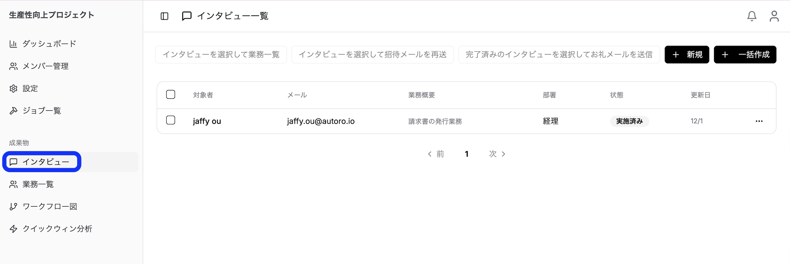
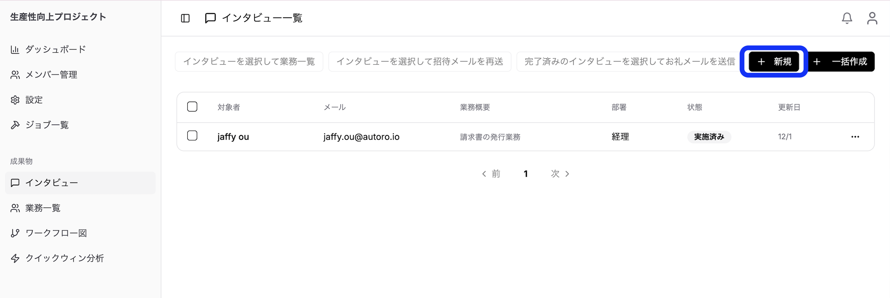
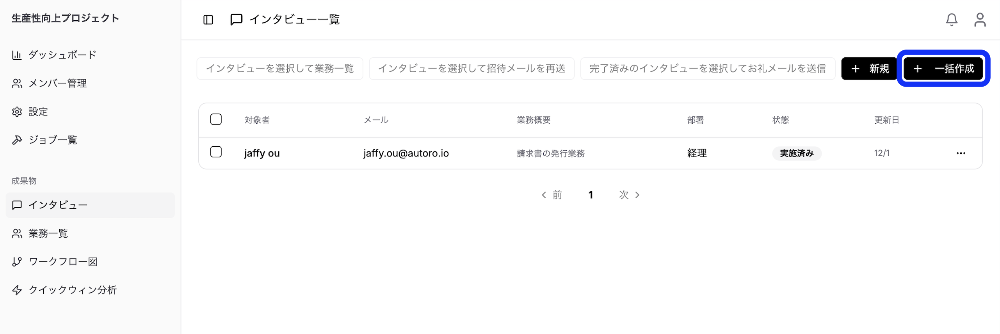

### 5.1 インタビュー一覧画面

サイドバーから「インタビュー」メニューを選択すると、インタビュー一覧画面が表示されます。

**表示項目：**
- 対象者名
- メールアドレス
- 業務概要
- 部署
- 状態（インタービュが実施されたかどうか）
- 更新日

### 5.2 インタビューの作成（単体/一括）

**単体作成：**

1. 「新規インタビュー」ボタンをクリック

2. 以下の情報を入力：
   - **インタビュイー名**（必須）
   - **メールアドレス**（必須）
   - **業務知識**（必須）：関連するドメイン知識を選択
   - **部署**（必須）
   - **業務概要**（必須）
3. 「作成」をクリック

**一括作成：**

1. 「一括追加」ボタンをクリック

2. 以下のいずれかの方法でデータを入力：
   - **コピー＆ペースト**: ExcelやCSVからセルをコピーして貼り付け
   - **手動入力**: テーブル形式で直接入力
3. データを確認し「一括作成」をクリック

### 5.3 インタビューステータスの管理

インタビューには以下のステータスがあります：

| ステータス | 説明 |
|-----------|------|
| **scheduling（日程調整中）** | インタビュー日程を調整中 |
| **contacted（連絡済み）** | 招待メールを送信済み |
| **reserved（予約済み）** | インタビュー日程が確定 |
| **in_progress（実施中）** | インタビュー実施中 |
| **completed（完了）** | インタビュー完了 |

ステータスは以下の方法で更新されます：
- 招待メール送信時：自動的に「連絡済み」に更新
- 手動更新：インタビュー詳細画面から変更

### 5.4 招待メールの送信

**個別送信：**

1. インタビュー一覧で対象者を選択
2. 「メール送信」アイコンをクリック
3. メール本文を確認・編集
4. 「送信」をクリック

**一括送信：**

1. インタビュー一覧で複数の対象者を選択
2. 「一括メール送信」ボタンをクリック
3. メール本文を確認・編集
4. 「送信」をクリック

送信されるメールには、インタビュー対象者専用のアクセスリンクが含まれます。このリンクからAIインタビューに参加できます。

### 5.5 インタビュー結果からの業務生成（AI機能）

インタビューが完了すると、AIを活用して業務情報を自動生成できます。

**業務自動生成の手順：**

1. 完了したインタビューを選択（複数選択可）
2. 「業務を生成」ボタンをクリック
3. AIがインタビュー内容を分析し、業務情報を抽出
4. 生成された業務が業務一覧に追加される
5. 処理完了は通知で確認

> **💡 ヒント：** 複数のインタビュー結果を組み合わせることで、より包括的な業務情報を生成できます。