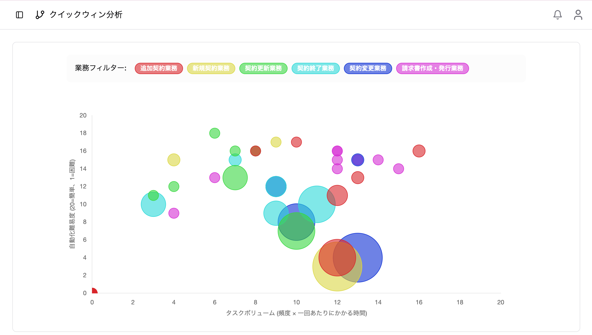

### 7.1 クイックウィンマップの見方



クイックウィンマップは、業務の自動化優先度をバブルチャートで可視化したものです。

**画面構成：**

```
縦軸（Y軸）: 自動化難易度（低い ← → 高い）
横軸（X軸）: タスク量スコア（少ない ← → 多い）
バブルサイズ: 関連人数スコア
バブル色: 業務名ごとに異なる色
```

**操作方法：**

- **バブルをクリック**: 業務の詳細を表示
- **複数バブルが重なっている場合**: クリックで選択ダイアログを表示
- **凡例（業務フィルター）**: バッジをクリックして表示/非表示を切り替え

### 7.2 自動化優先度の判断方法

クイックウィンマップでは、以下の位置にある業務が自動化の優先候補となります：

**優先度が高い領域（クイックウィン）：**
- **右下**: タスク量が多く、自動化難易度が低い
  - 大きな効果が得られやすく、実現も容易

**優先度が中程度の領域：**
- **右上**: タスク量が多いが、自動化難易度も高い
  - 効果は大きいが、実現に時間・コストがかかる
- **左下**: タスク量は少ないが、自動化は容易
  - 実現は容易だが、効果は限定的

**優先度が低い領域：**
- **左上**: タスク量が少なく、自動化難易度が高い
  - 費用対効果が低い

### 7.3 分析結果の活用

1. **クイックウィン候補の特定**: 右下領域の業務を優先的に検討
2. **段階的な自動化計画**: 難易度別にフェーズを分けて計画
3. **ROI分析の基礎データ**: スコアを基に投資対効果を試算
4. **ステークホルダーへの報告**: ビジュアルな形で優先度を共有

**クイックウィンマップの生成：**

1. 業務一覧画面で[「クイックウィン生成」](/guides/6-business-management/#65-クイックウィン生成)ボタンをクリック
2. AIがすべての業務を分析し、スコアを自動計算
3. 処理完了は通知で確認
4. サイドバーの「クイックウィン」メニューでマップを閲覧