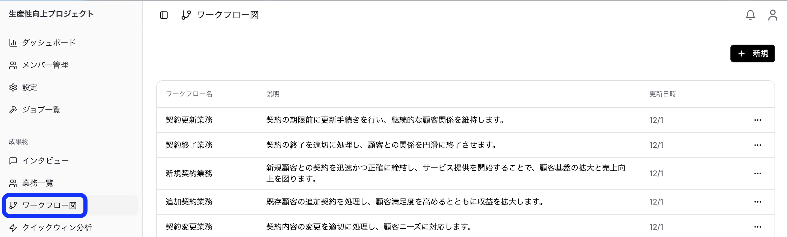
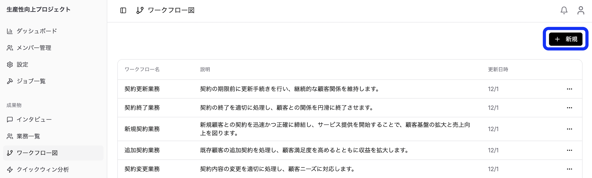
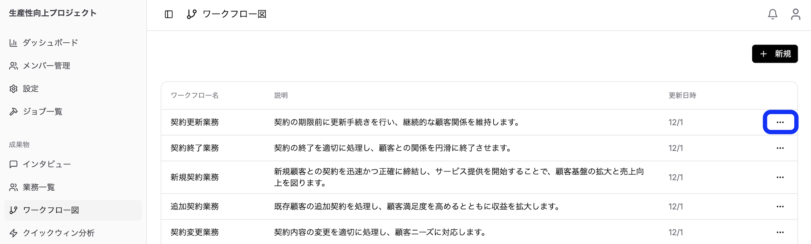
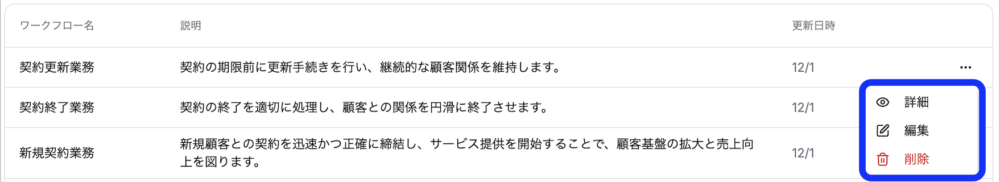
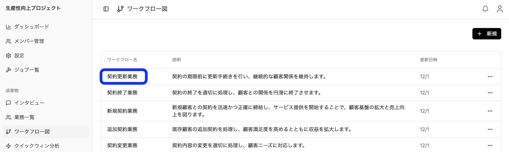
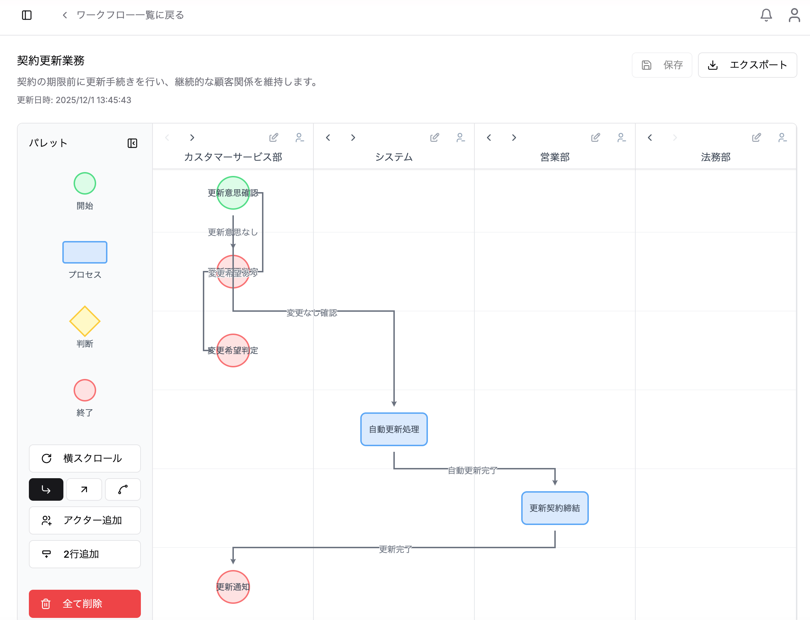

### 8.1 ワークフローの作成

**手動作成：**

1. サイドバーから「ワークフロー図」メニューを選択

2. 「新規」ボタンをクリック

3. 以下の情報を入力：
   - **ワークフロー名**（必須）
   - **説明**（必須）
4. 「作成」をクリック

**AIによる自動生成：**

1. 業務一覧画面で[「ワークフロー生成」](/guides/6-business-management/#66-ワークフロー生成)ボタンをクリック
2. 登録済みの業務情報を基に、AIがワークフローを自動生成
3. バックグラウンドで処理が実行される
4. 処理完了は通知で確認
5. 生成されたワークフローはワークフロー一覧に追加

> **💡 ヒント：** 業務情報が詳細であるほど、精度の高いワークフローが生成されます。

### 8.2 ワークフローの編集・削除

**編集：**

1. ワークフロー一覧から対象を選択

2. ワークフロー詳細画面で編集

3. 「保存」をクリック

**削除：**

1. 削除するワークフローを選択

2. 削除ボタンをクリック

3. 確認ダイアログで「削除」を選択

### 8.3 ワークフローの可視化

1. ワークフローを選択

2. 具体的なフロー図を表示

ワークフローはスイムレーン形式で可視化されます。

**表示される情報：**
- **レーン**: 担当者・部署ごとに分離
- **アクティビティ**: 各タスクのステップ
- **フロー**: タスク間の流れと依存関係