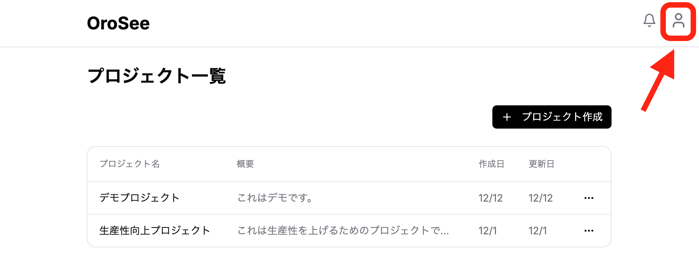

### 2.1 サインイン方法（マジックリンク認証）

OroSeeはパスワード不要の「マジックリンク認証」を採用しています。メールアドレスにログイン用のリンクが送信され、そのリンクをクリックするだけで安全にログインできます。

**ログイン手順：**

1. OroSeeのログイン画面（`/auth/signin`）にアクセス
2. メールアドレスを入力
3. 「メールでサインイン」ボタンをクリック
4. 入力したメールアドレスにログインリンクが送信される
5. メール内のリンクをクリック
6. 自動的にログインが完了し、プロジェクト一覧画面に遷移

> **💡 ヒント：** メールが届かない場合は、迷惑メールフォルダを確認してください。

### 2.2 招待リンクからの参加方法

既存のプロジェクトに招待された場合、以下の手順で参加できます。

**参加手順：**

1. 招待メールに記載されたリンクをクリック
2. 招待承認画面が表示される
   - プロジェクト名と付与される権限が表示される
   - 招待先メールアドレスが表示される
3. ログイン中のアカウントと招待先メールアドレスを確認
   - 異なる場合は警告が表示される
   - 必要に応じて別アカウントで再ログイン
4. 「参加する」ボタンをクリック
5. プロジェクトダッシュボードに自動遷移

> **⚠️ 注意：** 招待リンクには有効期限があります。期限切れの場合は、プロジェクト管理者に再度招待を依頼してください。

### 2.3 ログアウト

1. 画面右上のユーザーメニューをクリック
2. 「ログアウト」を選択
3. ログイン画面にリダイレクト