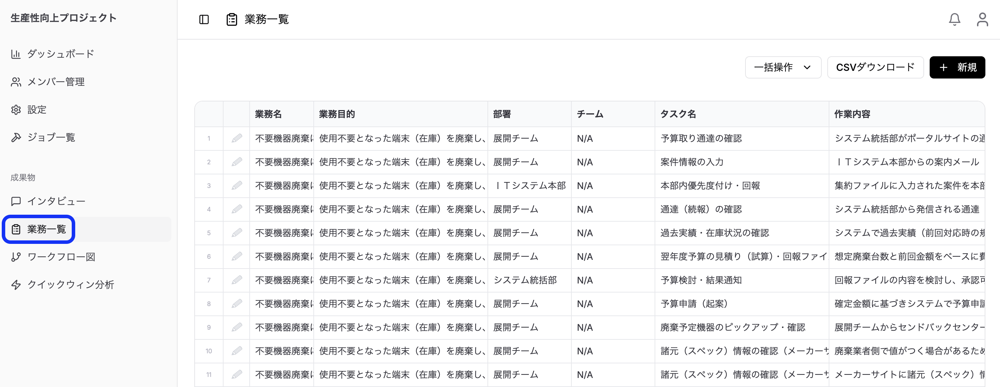

> **[③-1 インタビューを実施する](/guides/interview-management/) で生成された業務が、ここ（業務一覧）に集まります。** 内容を確認・整理し、このページを起点に「ワークフロー生成」「クイックウィン生成」へ分岐します。

### 業務一覧画面の見方

サイドバーから「業務一覧」メニューを選択すると、業務一覧画面が表示されます。

業務一覧は高機能なデータグリッド形式で表示され、以下の操作が可能です：

**基本操作：**
- **スクロール**: 大量のデータをスムーズに閲覧
- **セル編集**: セルをダブルクリックで直接編集
- **行選択**: 行をクリックして選択（複数選択もできます）
- **並べ替え**: 列ヘッダーをクリックしてソート
- **列幅調整**: 列境界をドラッグして幅を調整

**表示される項目：**

| 項目 | 説明 |
|-----|------|
| 業務名 | 業務の識別名 |
| 業務目的 | 業務の目的・ゴール |
| 部署 | 担当部署 |
| チーム | 担当チーム |
| タスク名 | 具体的なタスク名 |
| 作業内容 | タスクの詳細説明 |
| 連携部署 | 連携する他部署 |
| 担当者 | 実行担当者 |
| 発生起点 | 業務開始のきっかけ |
| システム | 使用するシステム |
| インプット | 入力データ・情報 |
| アウトプット | 出力データ・成果物 |
| 時間 | 作業に要する時間（分） |
| 頻度 | 実行頻度 |
| タスクボリューム | 作業量の評価（1-20） |
| 自動化適正スコア | 自動化の困難さ（1-20） |
| 関連者数 | 関係者の数（1-♾️） |
| 推奨事項 | AIによる改善提案 |

### 業務の登録・編集・削除

**新規登録：**

1. 「新規」ボタンをクリック
2. 業務編集ダイアログで情報を入力
3. 「保存」をクリック

**編集：**

- **インライン編集**: セルを直接クリックして編集
- **ダイアログ編集**: 行を選択して詳細ダイアログを開く

**削除：**

1. 削除する業務を選択（複数選択可）
2. Deleteキーを押すか、削除ボタンをクリック
3. 確認ダイアログで「削除」を選択

### スコアリングについて

各業務には「タスク量スコア」「自動化適正スコア」「関連人数スコア」の3つのスコアが設定されます。これらは手動で入力するものではなく、**クイックウィン生成時にAIが自動で算出・設定**します。

各スコアの意味・目安は [③-4 クイックウィンを分析する](/guides/quick-win-analysis/#スコアリング項目) を参照してください。

### CSVエクスポート

1. 業務一覧のセルを選択
2. CSVダウンロードをクリック

### 次の工程へ：ワークフロー / クイックウィンの生成

整理した業務データを起点に、2つの分析へ進めます（どちらから行っても構いません）。手順の詳細は各ページを参照してください。

- **ワークフロー生成**：業務の流れ（プロセスフロー）を自動で図解します。→ 詳細は [③-3 ワークフローを確認・活用する](/guides/workflow-management/)
- **クイックウィン生成**：どの業務から着手すべきかをバブルチャートで可視化します。→ 詳細は [③-4 クイックウィンを分析する](/guides/quick-win-analysis/)

