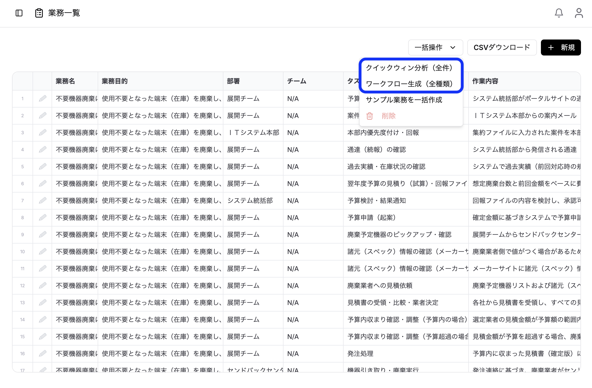
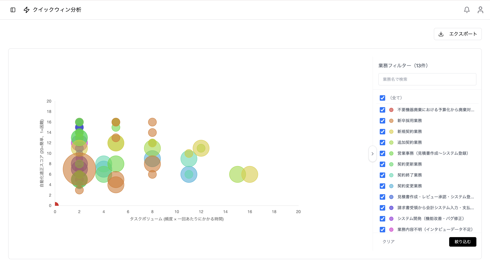

> **[③-2 業務を整理する](/guides/business-management/) の「クイックウィン分析」で作られたマップを、ここで読み解きます。** 運用フローの最終ステップとして、どの業務から自動化・改善に着手すべきかを判断します。（③-3 ワークフローと並ぶ、業務一覧からの分岐先の一つです。）

### クイックウィンマップの生成

1. [業務一覧画面](/guides/business-management/#次の工程へワークフロー生成--クイックウィン分析)で「クイックウィン分析」ボタンをクリック

2. AIがすべての業務を分析し、スコアを自動計算
3. 処理完了は通知で確認
4. サイドバーの「クイックウィン」メニューでマップを閲覧

### クイックウィンマップの見方



クイックウィンマップは、業務の自動化優先度をバブルチャートで可視化したものです。

**画面構成：**

```
縦軸（Y軸）: 自動化適正スコア（低い ↓ ↑ 高い）
横軸（X軸）: タスク量スコア（少ない ← → 多い）
バブルサイズ: 関連人数スコア
バブル色: 業務名ごとに異なる色
```

**操作方法：**

- **バブルをクリック**: 業務の詳細を表示
- **複数バブルが重なっている場合**: クリックで選択ダイアログを表示
- **凡例（業務フィルター）**: バッジをクリックして表示/非表示を切り替え

### スコアリング項目

各スコアは、クイックウィン分析時にAIが業務内容を分析して**自動で算出・設定**します（手動入力ではありません）。それぞれの意味と目安は以下のとおりです。

#### タスク量スコア

作業の量や負荷を1〜20で評価します。

| スコア | 目安 |
|-------|------|
| 1-6 | 軽微な作業（数分程度） |
| 6-12 | 中程度の作業（30分〜数時間） |
| 12-20 | 大規模な作業（終日以上） |

#### 自動化適正スコア

自動化の実現難易度を1〜20で評価します。

| スコア | 目安 |
|-------|------|
| 1-6 | 困難（高度な判断、非構造化データ処理） |
| 6-12 | 中程度（一部判断が必要、複数システム連携） |
| 12-20 | 容易（定型的、ルールベースで対応可能） |

#### 関連人数スコア

業務に関わる人数を1〜♾️で評価します。

| スコア | 目安 |
|-------|------|
| 1-3 | 少人数（1-2名） |
| 4-6 | 中規模（3-10名） |
| 7-10 | 大規模（10名以上、複数部署） |

### 自動化優先度の判断方法

クイックウィンマップでは、以下の位置にある業務が自動化の優先候補となります：

**自動化適正スコアが高いほど、その業務は自動化しやすいことを表します。**  
そのため、タスク量が多く、かつ自動化適正スコアが高い業務ほど、優先的に自動化を検討する価値があります。

**優先度が高い領域（クイックウィン）：**

- **右上**: タスク量が多く、自動化適正スコアも高い
  - 大きな効果が得られやすく、実現もしやすい

**優先度が中程度の領域：**

- **右下**: タスク量は多いが、自動化適正スコアが低い
  - 効果は大きいが、実現に時間・コストがかかる可能性がある
- **左上**: タスク量は少ないが、自動化適正スコアが高い
  - 実現はしやすいが、効果は限定的

**優先度が低い領域：**

- **左下**: タスク量が少なく、自動化適正スコアも低い
  - 費用対効果が低い

### 分析結果の活用

1. **クイックウィン候補の特定**: 右上領域の業務を優先的に検討
2. **段階的な自動化計画**: 難易度別にフェーズを分けて計画
3. **ROI分析の基礎データ**: スコアを基に投資対効果を試算
4. **ステークホルダーへの報告**: ビジュアルな形で優先度を共有