> **[③-2 業務を整理する](/guides/business-management/) の「ワークフロー生成」で作られたワークフローを、ここで確認・活用します。** （③-4 クイックウィン分析と並ぶ、業務一覧からの分岐先の一つです。順序の依存はありません。）

## 業務からワークフローを自動生成する（AI）

通常はこの方法でワークフローを作成します。

1. [業務一覧画面](/guides/business-management/#次の工程へワークフロー生成--クイックウィン分析)で「ワークフロー生成」ボタンをクリック

2. 登録済みの業務情報を基に、AIがワークフローを自動生成
3. バックグラウンドで処理が実行される
4. 処理完了は通知で確認
5. 生成されたワークフローはワークフロー一覧に追加

> **💡 ヒント：** 業務情報が詳細であるほど、精度の高いワークフローが生成されます。

## ワークフローを手動で作成する（任意）

1. サイドバーから「ワークフロー図」メニューを選択
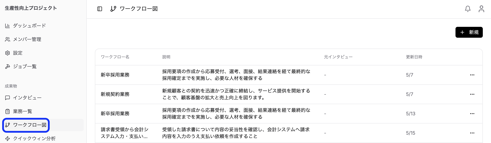
2. 「新規」ボタンをクリック
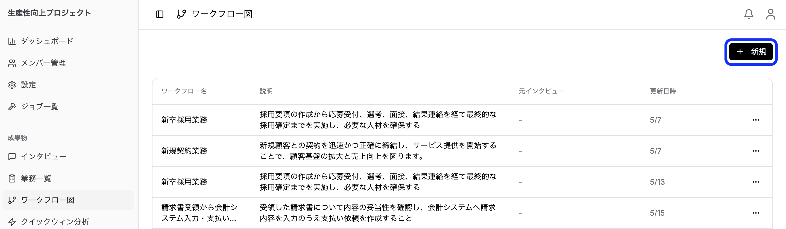
3. 以下の情報を入力：
   - **ワークフロー名**（必須）
   - **説明**（必須）
4. 「作成」をクリック

## ワークフローの可視化

1. ワークフローを選択
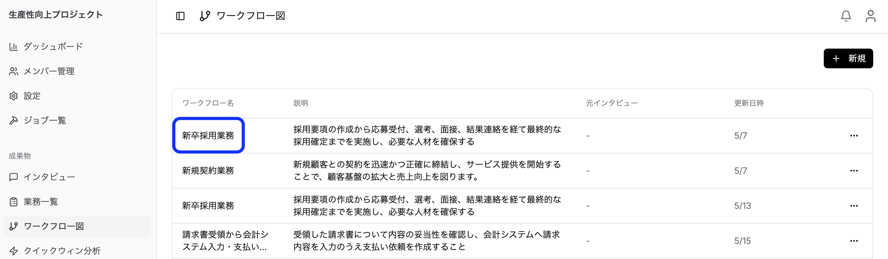
2. 具体的なフロー図を表示
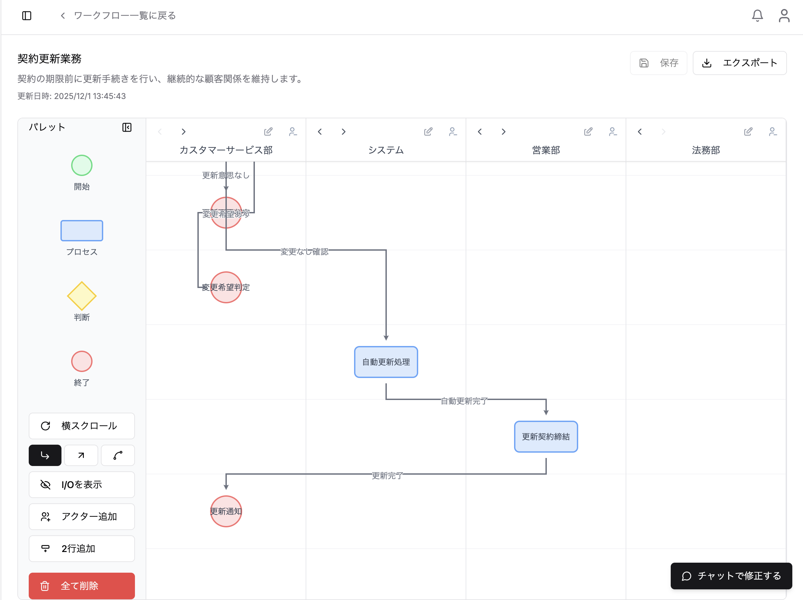

ワークフローはスイムレーン形式で可視化されます。

**表示される情報：**
- **レーン**: 担当者・部署ごとに分離
- **アクティビティ**: 各タスクのステップ
- **フロー**: タスク間の流れと依存関係

### 入力データと出力データの可視化
各フローにおける入出力のデータを可視化できます。
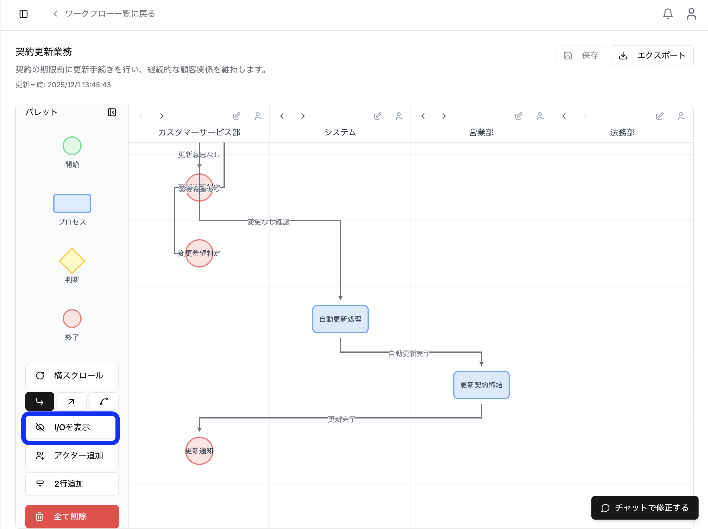
左側の *(I/O)* ボタンをクリックする各ワークフロの入出力データを確認できます。

### 矢印の操作
1. ブロックごとに繋がっている矢印をクリックしたまま上下に動かすことで見やすくすることができます。
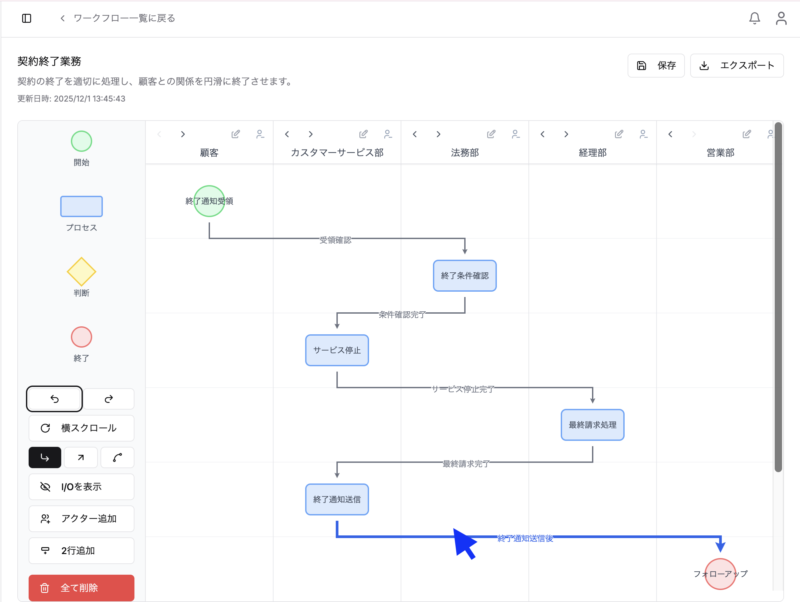
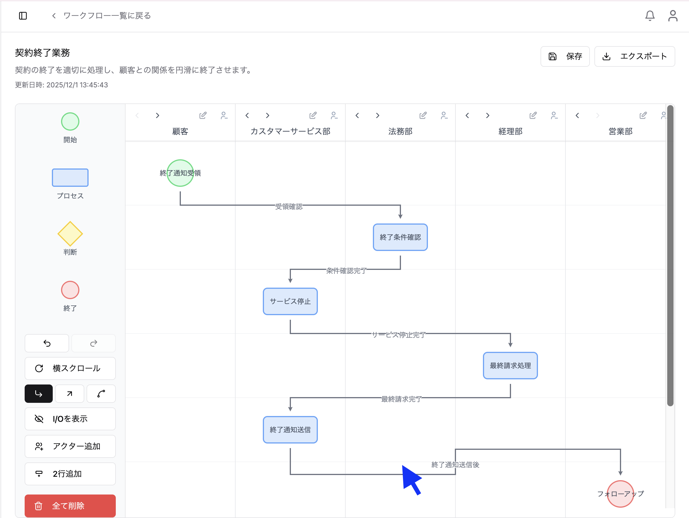
2. 矢印がいらない時に矢印をクリックして削除することができます。
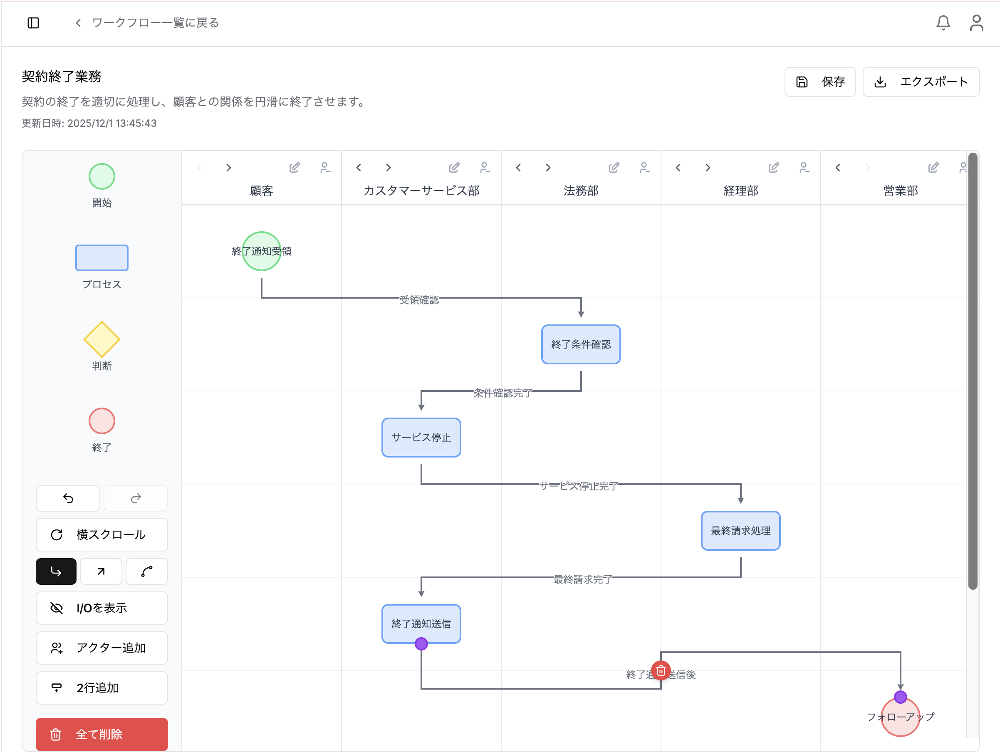

### 操作の取り消し
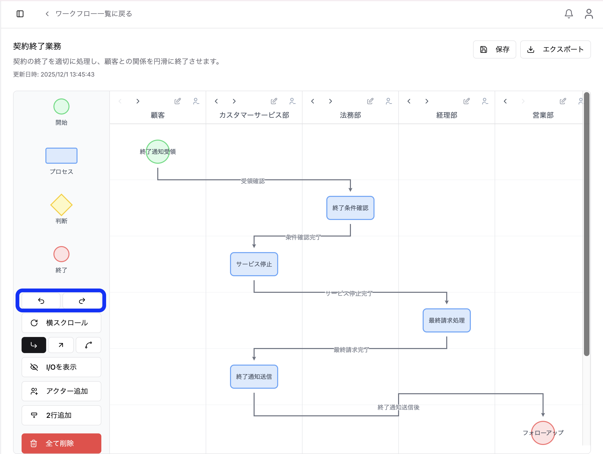
行った操作を取り消したいときは「戻る」ボタン、取り消しをやり直したいときは「進む」ボタンをクリックします。

## ワークフローの編集・削除

**編集：**

1. ワークフロー一覧から対象を選択
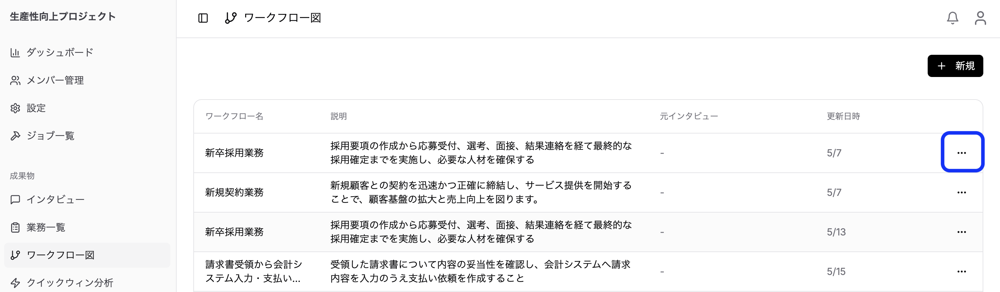
2. ワークフロー詳細画面で編集
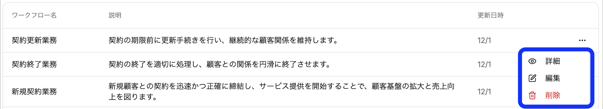
3. 「保存」をクリック

**削除：**

1. 削除するワークフローを選択

2. 削除ボタンをクリック

3. 確認ダイアログで「削除」を選択