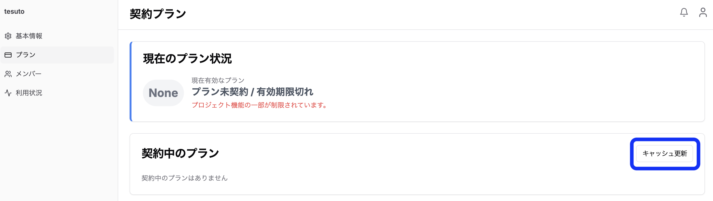

### 10.1 プラン情報のキャッシュ
OroSee では、プラン情報は1日間（24時間）キャッシュされます。

キャッシュの仕組み
| 項目 | 内容 |
| --- | --- |
| キャッシュ期間 | 24時間（1日） |
| 更新タイミング | キャッシュ期間経過後、次回アクセス時に自動更新 |
| 手動更新 | 「キャッシュ更新」ボタンで即時反映可能 |

**プラン変更を即時反映するには**
プランを変更した後、変更内容をすぐにシステムに反映させたい場合は、以下の手順で手動更新を行ってください。

